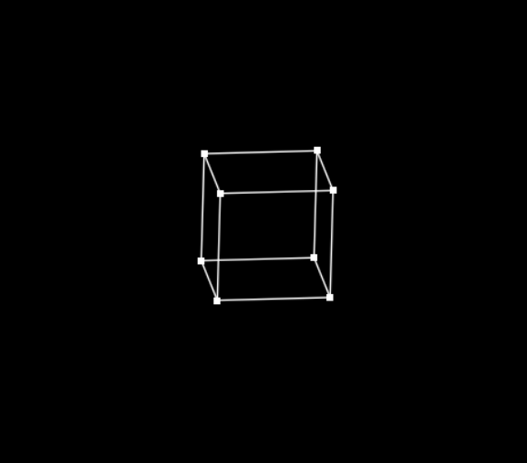

# Spinning Cube  - Love2D

This project applies Rotation Matrices to a set of points in the shape of a cube, in 3-dimentional space. 
Those points are drawn to the screen, and connected with lines.

## How to use

You must have Love2D installed on your machine. 
Please note that this is a  `.lua`  file, so this program is run using the Love2D extension for VSCode.
Simply install it, and press  `ALT + L`  to run your program
